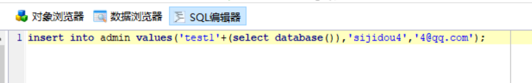
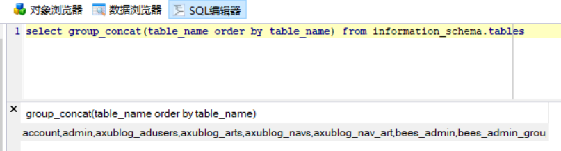

在sql注入中，如果用length返回的最大长度是1024，即如下情况



我在无法获取当前数据库名的情况下，最先尝试直接通过爆破table_name字段获取有用信息，但是超过1024后脚本就抛出异常了

在mysql中的`information_schema`有如下规则,但新添的`数据库名`，`表名`，`字段名`是在整个`information_schema`表的最后~~（这不是废话么）~~,那么可以通过这样的方式来查询最新添加的情况

```
select group_concat(table_name order by table_name) from information_schema.tables
```



在mysql中无法用`select database()`返回数据库名，可能是在后端代码对数据库操作时并未指定操作数据库对象，那么在一般调用是就会使用这样的格式

```
select * from dbname.tablename
```

平时对于mysql的注入常常都是按套路爆数据库名，爆表名，爆字段名，爆内容，那么对应在`information_schema`数据库中对于表的字段含义


1.`information_schema.tables`表示整个账号所有的`table`

`table_schema` 该表所属的数据库

`table_name` 该表的表明，可能存在多个数据库有相同的表明


2.`information_schema.columns`表示整个账号所有的`column`

`column_name`该字段的名字

`table_name`该字段的所属表名字

`table_schema` 该表所属的数据库的名字


综上所述，`columns`表和`tables`表都有`table_name`和`table_schema`2个属性


知识点来源 XCTF 4th-CyberEarth ics-04
